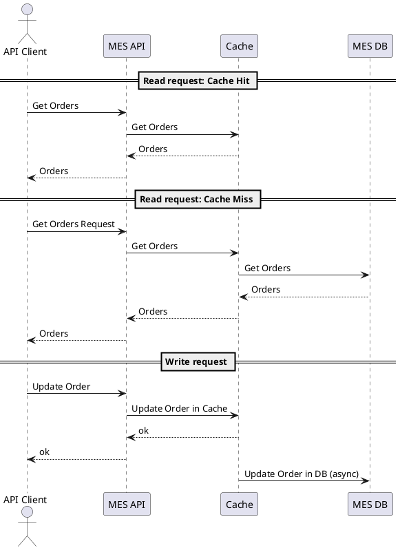

# Архитектурное решение по кешированию

## Мотивация

Предлагаю внедрить кэширование для улучшения пользовательского опыта работы с системой - запросы будут обрабатываться быстрее.
Также это поможет уменьшить нагрузку на базу данных.

Предлагаю внедрить клиентское HTTP кэширование для всех UI систем - Shop UI, CRM UI, MES UI.
Серверное кэширование нужно обязательно добавить в MES.
В перспективе стоит рассмотреть внедрение серверного кэширования также в Shop и CRM для снижения нагрузки на базу данных и более быстрого отклика

## Предлагаемое решение

Добавить клиентское HTTP кэширование во все фронтэнды - Shop UI, CRM UI, MES UI. 
Рекомендуется использовать HTTP заголовок для проверки актуальности данных:

```
Cache-Control: no-cache
```

Добавить серверное кэширование в MES.

Предлагаю использовать смешанную стратегию - Read Through и Write Behind. 
Это позволит ускорить операции чтения, не усложнив при этом приложение.
Паттерн записи Write Behind позволит быстро обновить данные, не дожидаясь обновления базы - и данные сразу будут видны другим операторам.

Инвалидацию данных предлагаю сделать по ключу - это позволит минимизировать объём инвалидации и обновлять только необходимые данные, улучшая производительность и уменьшая нагрузку на систему.

### Диаграмма взаимодействия для MES:




