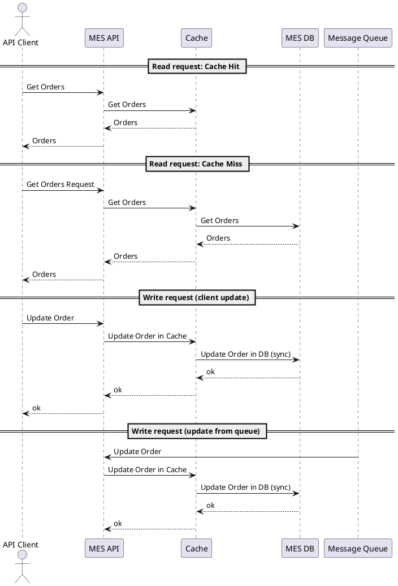

# Архитектурное решение по кешированию

## Мотивация

Предлагаю внедрить кэширование для улучшения пользовательского опыта работы с системой - запросы будут обрабатываться быстрее.
Также это поможет уменьшить нагрузку на базу данных.

Предлагаю внедрить клиентское HTTP кэширование для всех UI систем - Shop UI, CRM UI, MES UI.
Серверное кэширование нужно обязательно добавить в MES.
В перспективе стоит рассмотреть внедрение серверного кэширования также в Shop и CRM для снижения нагрузки на базу данных и более быстрого отклика

## Предлагаемое решение

Добавить клиентское HTTP кэширование статической информации (картинки, стили, js, шрифты) во все фронтэнды - Shop UI, CRM UI, MES UI.

Добавить серверное кэширование в MES.

Предлагаю использовать смешанную стратегию - Read Through и Write Through. 
Это позволит ускорить операции чтения, не усложнив при этом приложение.
Паттерн записи Write Through позволит обновлять данные через кэш, что гарантирует консистентность данных в кэше. 
Инвалидация в таком случае будет не нужна.

### Диаграмма взаимодействия для MES:

```puml
@startuml
'https://plantuml.com/sequence-diagram


actor "API Client" as client
participant "MES API" as api
participant Cache as cache
participant "MES DB" as db
participant "Message Queue" as queue

== Read request: Cache Hit ==
client -> api: Get Orders
api -> cache: Get Orders
cache --> api: Orders
api --> client: Orders

== Read request: Cache Miss ==

client -> api: Get Orders Request
api -> cache: Get Orders
cache -> db: Get Orders
db --> cache: Orders
cache --> api: Orders
api --> client: Orders

== Write request (client update) ==

client -> api: Update Order
api -> cache: Update Order in Cache
cache -> db: Update Order in DB (sync)
db --> cache: ok
cache --> api: ok
api --> client: ok

== Write request (update from queue) ==

queue -> api: Update Order
api -> cache: Update Order in Cache
cache -> db: Update Order in DB (sync)
db --> cache: ok
cache --> api: ok

@enduml
```

